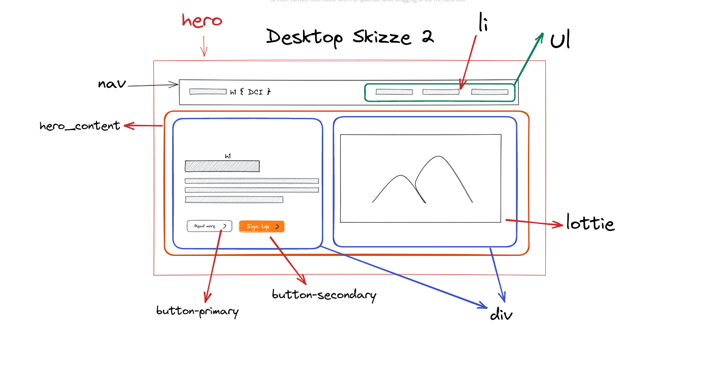

# sass-hero

## Einführung

Sass Hero Projekt Screenshot

#

<br>

## :hugs: Einleitung:

Dies ist ein Anfänger freundlich Spaß Sass Projekt.

Wir haben dass während unser HTML & CSS Module in DCI Front-end Web Dev Kurs erstellt.

<hr>

## :package: Verwendete Pakete:

- Vanilla HTML5, CSS3 und Live Sass Compiler VS Code Extension

- Lottie Animation von [Lottie Files](https://lottiefiles.com/)

```js
// in HTML Head eingefügt
<script src="https://unpkg.com/@lottiefiles/lottie-player@latest/dist/lottie-player.js"></script>


// in Code verwendet

 <script src="https://unpkg.com/@lottiefiles/lottie-player@latest/dist/lottie-player.js"></script>

<lottie-player
    src="https://assets10.lottiefiles.com/packages/lf20_wg0utmug.json"
    background="transparent"
    speed="1"
    style="width: 500px; height: 500px"
    hover
    autoplay
></lottie-player>
```

- Skizze mit [Excalidraw](https://excalidraw.com/)


<br>



#

## :bulb: Sass Fähigkeiten betroffen:

<br>

1. Die Fähigkeit, Sass mit Live Sass Compiler einzurichten

<br>

2. Die Fähigkeit HTML und CSS Datei mit Scripts zu verknüpfen
   <br>

3. Die folgende Sass Eigenschaften in Front-end Projekte zu verwenden;

   - Variablen

   - Verschachtelung
   - Partials(\_partial.scss-Dateien)
   - Module
   - Erweitern/Verererbung
     <br>

4. Die Fähigkeit Projekte mit GitHub zu verwalten.

---

## Danke!
